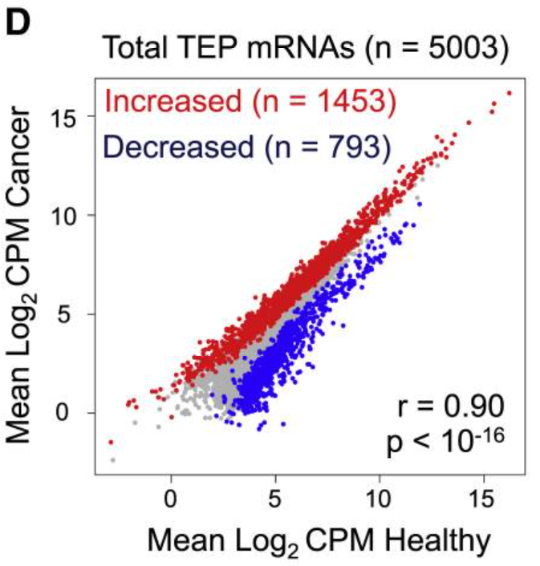
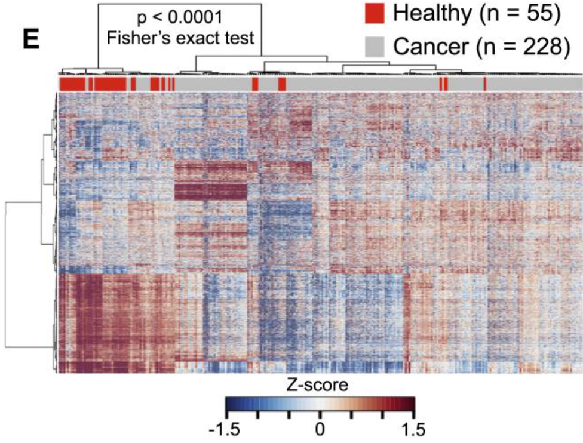
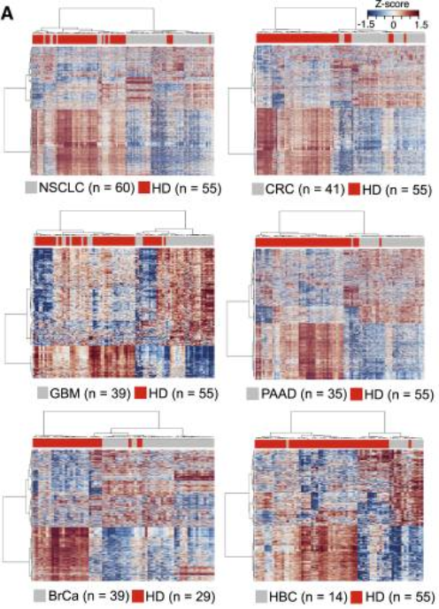
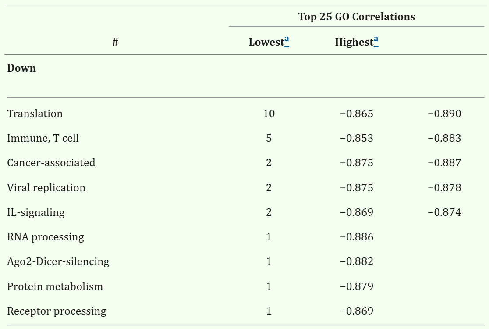
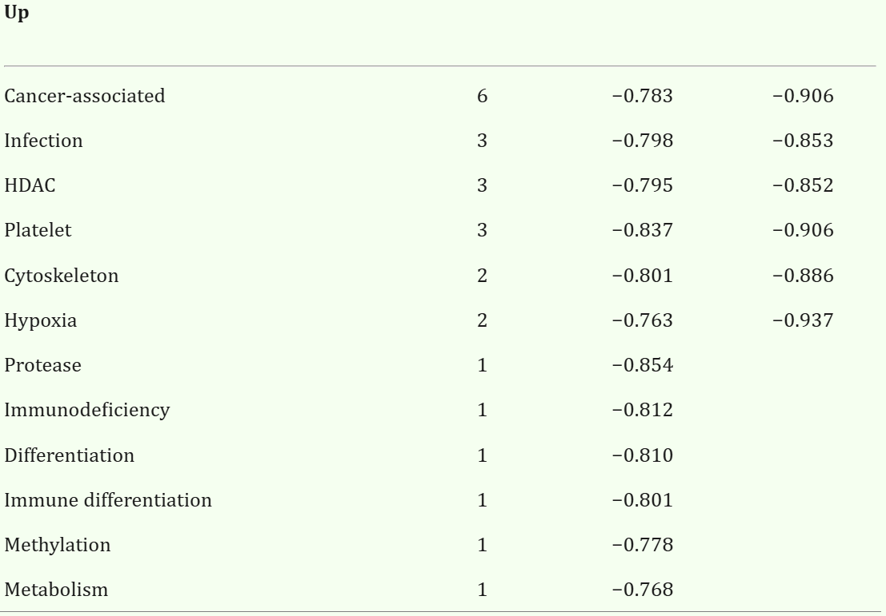
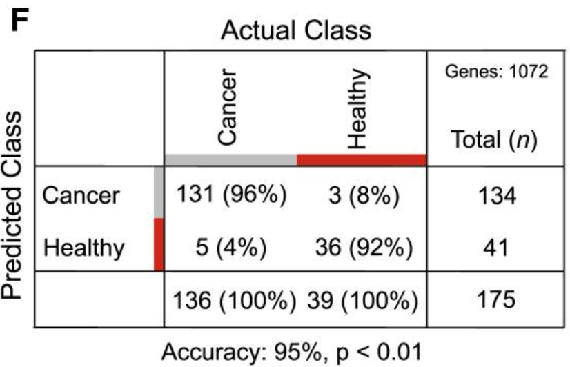
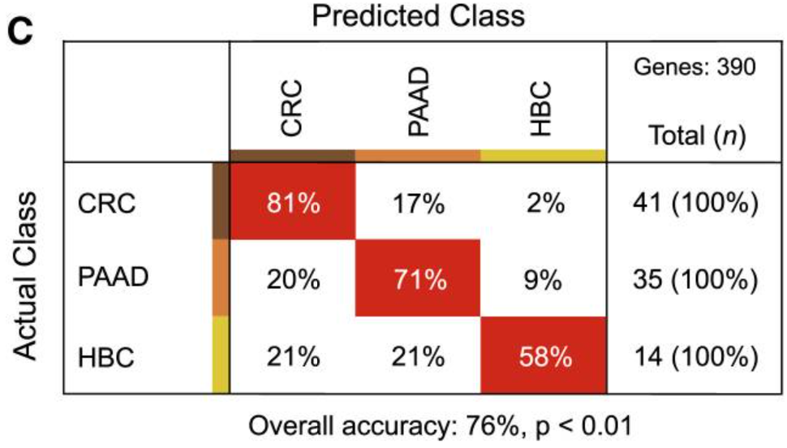
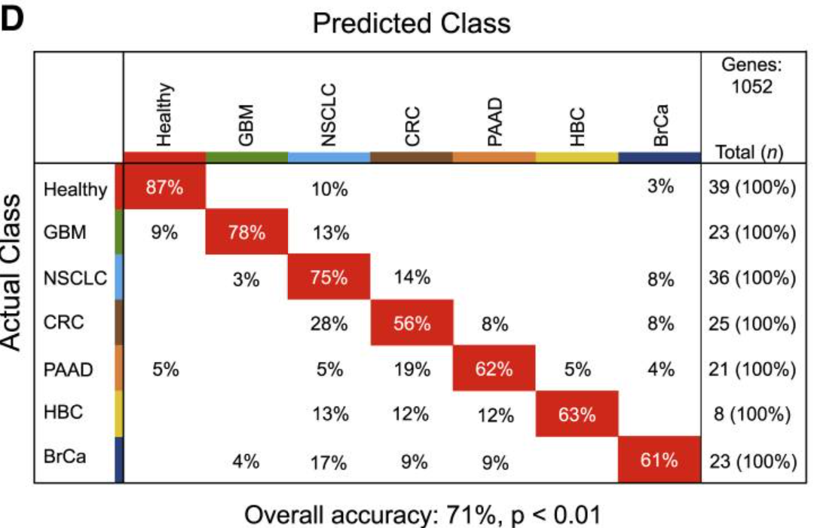

```{r setup, include=FALSE}
library(knitr)
knitr::opts_chunk$set(echo = TRUE)

```

## Introduction {#introduction}

Modern cancer diagnostics increasingly rely on molecular profiling (Akbani et al., 2014, Golub et al., 1999, Han et al., 2014, Hoadley et al., 2014, Kandoth et al., 2013, Ramaswamy et al., 2001, Su et al., 2001), yet tissue biopsies remain invasive, complex, and often impractical in clinical settings, especially considering the varying conditions of cancer patients in practice. 

Many of the sampling methods that can be used for cancer diagnosis are limited by a variety of factors, including the tumor micro-environment, the stage of cancer regarding it's dissemination and metastasis in the body, the position of the cancer relative to vital organs, and other factors that can impede progress in diagnosis. One suggested method to overcome these limitations (Alix-Panabières et al., 2012, Crowley et al., 2013, Haber and Velculescu, 2014) and continue testing for diagnosis is to use a **blood based liquid biopsy**, which uses blood as a medium for specimen testing.

A study, "RNA-Seq of Tumor-Educated Platelets Enables Blood-Based Pan-Cancer, Multiclass, and Molecular Pathway Cancer Diagnostics" by Best et al., was conducted in 2015, which investigates whether RNA sequencing of platelets in blood samples can be used as a reliable method for cancer diagnosis across multiple cancer types.

The study conducted by Best et al. determined that RNA sequencing of tumor-educated platelets (TEPs) **can serve as a method for blood-based cancer diagnostics**. Tumor-educated platelets (TEPs) are blood platelets whose RNA profiles have been altered through interaction with tumor cells and the tumor microenvironment. By analyzing platelet RNA from 283 samples (228 from cancer patients and 55 from healthy donors), a 96% accuracy was achieved in distinguishing cancer patients from healthy patients and 71% accuracy in identifying the primary tumor type across six cancers. 

### Aim {#aim}

This paper aims to evaluate the validity and accuracy of the study "RNA-Seq of Tumor-Educated Platelets Enables Blood-Based Pan-Cancer, Multiclass, and Molecular Pathway Cancer Diagnostics" by Best et al.

This paper does this by attempting to:

- Replicate key figures from the original study using their published data, including the
  
  - LogCPM expression graph,
  
  - heatmaps with unsupervised clustering, 
  
  - substituting DAVID GO enrichment with CAMERA-based gene set enrichment analysis and 
  
  - SVM classification performance to assess functional annotation.

- Assess and compare the performance of our replicated models versus those reported by Best et al., specifically evaluating accuracy, sensitivity, and specificity across the validation cohorts.

- Identify and document any methodological gaps, discrepancies, or reproducibility issues encountered during replication, providing insights into the robustness and generalizability of the original study’s findings.

### Methods {#methods}
    
#### Sample Collection and Patient Information

In the study conducted by Best et al. (2015), peripheral blood samples were collected from healthy donors (n = 55) and cancer patients (n = 228) across multiple cancer types, including glioblastoma, non-small cell lung cancer (NSCLC), colorectal cancer, pancreatic adenocarcinoma, breast carcinoma, and hepatobiliary carcinoma. For each patient, associated cancer-specific mutations and prior or ongoing treatments—including surgery, chemotherapy, and radiotherapy—were recorded.

Whole blood was drawn into purple-cap BD Vacutainer tubes containing ethylenediaminetetraacetic acid (EDTA) as an anticoagulant. Platelets and plasma were isolated using a two-step centrifugation protocol (Best et al., 2015). Initially, whole blood was centrifuged at room temperature for 20 minutes at 120 × g to obtain platelet-rich plasma (PRP). Subsequently, PRP was centrifuged at 360 × g for 20 minutes to isolate the platelet pellet. Plasma was further centrifuged at 5000 rpm for 10 minutes to remove residual cellular debris and stored at −80°C for later nucleic acid extraction.

#### RNA Isolation and Library Preparation

Total RNA was extracted from the isolated platelets. Complementary DNA (cDNA) synthesis and amplification were performed using the SMARTer Ultra Low RNA Kit for Illumina Sequencing v1 (Clontech). Amplification targeted known mutation hotspots using high-fidelity polymerases to produce circular DNA amplicons suitable for next-generation sequencing. Quality and quantity of cDNA were assessed using the Agilent Bioanalyzer 2100 system with the DNA High Sensitivity chip. Sequencing libraries were prepared according to the manufacturer’s protocol and sequenced on an Illumina platform. Resulting reads were aligned to the human reference genome to generate expression matrices for downstream analysis.

#### Data Access and Preprocessing

This study closely followed the instructions and procedures of that seen in Best et al.'s report and the provided supplementary information files that depicted their procedures and steps in closer detail. Also provided with the supplementary information was the data, inclusive of processed gene expression data and classifier gene sets in respective datasheets (`mmc2.xlsx` to `mmc8.xlsx`). It's important to note that the data analysis had excluded the Y chromosome and mitochondrial DNA to minimize sex-based bias.

#### Log-Transformed counts per million (logCPM) Distributions

Best et al. were able to produce a scatter plot in their report (Figure 1D) that described a correlation plot of mRNAs detected in healthy donor (HD) platelets and cancer patients’ TEPs, and on the graph was a related Pearsons' correlation coefficient (as r), the associated p value, and the sample size. Best et al. did not describe the process by which they produced this scatter plot, and hence this report could only assume a method that would produce a similar result and proceed. This report was able to use R libraries 'EnsDb.Hsapiens.v86', 'edgeR', 'readr', 'org.Hs.eg.db', and 'ggplot2' to create our reproductions of the original report's scatter plot. Without a discolsed method from Best et al., we were unable to produce graphs that contained the specific information seen in the original graph, including the Pearsons' correlation coefficient (as r), the associated p value, and the sample size. 

Differential gene expression was assessed using a filtering strategy analogous to that employed in edgeR, based on logCPM thresholds to retain sufficiently expressed genes. Due to limited methodological transparency in the original publication, some statistical thresholds and preprocessing decisions were approximated based on available data and description.

#### Heatmaps

Heatmaps based on the mRNA profiles are included in Best et al.’s report (Figure 1E, Figure 2A), without instructions describing the method they used to produce these heatmaps in the report or the supplemental information. Thus, this study produces heatmaps that use the same data to feasibly reproduce the original graphs but not necessarily via the same process, as it is undisclosed by the authors of the original report. This report uses R libraries ‘limma’ and ‘dplyr’ to filter the data to include specific focal data (being separating groups by healthy donor, cancer patient and separating by cancer type) and reproduce the heatmaps from the original report. However, without specific guidance, this study does not present on the graph itself certain statistics seen in Best et al’s heatmaps, including a displayed population size and the fisher’s exact test value.

#### Gene Set Enrichment Analysis

An important distinction that separates our report from Best et al., is that we used CAMERA over DAVID-GO (Database for Annotation, Visualization, and Integrated Discovery - Gene Ontology) in our gene set enrichment analysis. CAMERA is a function of the 'limma' R package that is capable of gene set enrichment analysis, and we chose to use CAMERA over the DAVID-GO method described by Best et al., because we lacked data regarding the exact gene sets that they used in their analysis, which would've been critical in our reproduction of their results. To mitigate this discrepancy, we substituted DAVID-GO analysis with CAMERA through 'limma', and proceeded with our data analysis through the report.

#### Classification and Validation

Support vector machine (SVM) models were implemented in Python using the scikit-learn library. In the original report, Best et al. applied variations of k-fold cross-validation techniques, being leave-one-out (k=1) and 10-fold cross validation, to produce models and evaluate their accuracy for both binary and multiclass classification tasks. Linear kernel SVMs were trained using feature gene sets specified in the supplementary tables. Where hyperparameter values (e.g., C, gamma) were not disclosed, parameter tuning was performed empirically to optimize classification performance.

Validation was conducted using the original partitioning schema from Best et al. (2015), with 175 samples allocated to training and 108 to the validation cohort for a total 283 samples. Classifier performance was evaluated in terms of accuracy, sensitivity, and specificity.

## Experimental Design and Workflow

The methodology employed by Best et al. (2015) is largely appropriate for investigating tumor-educated platelets (TEPs) as a non-invasive biomarker source for cancer diagnostics. Their design demonstrates ethical and practical considerations by prioritizing minimal patient burden through the use of blood-based liquid biopsies rather than tissue sampling. This aligns well with the clinical utility they propose—routine, low-risk diagnostics that can be applied even in vulnerable patient populations. Furthermore, the use of RNA-seq and a support vector machine (SVM) classifier for multiclass cancer prediction is methodologically sound and reflects a thoughtful integration of transcriptomic data with machine learning for diagnostic applications.

However, the experimental design could be improved by addressing the potential bias introduced by excluding samples with low RNA yield or reduced predictive value. While this exclusion criterion strengthens statistical power and model robustness, it also introduces the risk of discarding biologically informative outliers, including rare transcripts or low-abundance biomarkers that could prove relevant, particularly in early-stage or heterogeneous cancers. Incorporating a secondary analysis pipeline that includes these marginal samples could help uncover additional diagnostic signals.

Moreover, the decision to omit genes located on the Y chromosome and mitochondrial genome is justifiable given the goal of minimizing gender-associated confounding variables. Nonetheless, such exclusion limits the scope of discovery. These genomic regions may harbor cancer-relevant signals that, while gender-specific, could enhance stratified diagnostics if analyzed in sex-separated cohorts. A future iteration of the study would benefit from a parallel analysis including these regions under stratified conditions.

Overall, the experimental workflow is replicable and conceptually robust, but opportunities exist to broaden its inclusivity and interpretive depth without compromising clinical relevance.

## Results {#results}

### Correlation of TEP mRNA Expression Between Cancer Patients and Healthy Donors

#### Best et al.



The scatter plot shows a strong positive correlation (r = 0.90, p < 10⁻¹⁶) between mean log₂ CPM values of TEP mRNAs in cancer patients and healthy donors. Notably, 1,453 transcripts were significantly increased and 793 were decreased in cancer, indicating distinct platelet mRNA expression patterns associated with disease status.

#### Attempted Reproduction

A differential expression analysis on platelet RNA-seq data was conducted by filtering for intron-spanning, autosomal genes, normalizing counts, and identifying genes with significant expression differences between cancerous and healthy samples. It calculates log-transformed CPM values, classifies genes based on fold change and FDR, and computes the correlation between average expression in healthy and cancerous groups (r and p values reported).

```{r, warning=FALSE, message=FALSE}
# find human intron-spanning genes
library(EnsDb.Hsapiens.v86)
edb <- EnsDb.Hsapiens.v86
exons_by_gene_ensembl <- exonsBy(edb, by = "gene")
# Count exons per gene
exon_counts_ensembl <- elementNROWS(exons_by_gene_ensembl)
# Genes with > 1 exon
intron_spanning_genes_ensembl <- names(exon_counts_ensembl)[exon_counts_ensembl > 1]

# Read in data as tibble and convert to df
library(edgeR)
library(readr)
library(org.Hs.eg.db)
library(ggplot2)

df_all_counts = as.data.frame(readr::read_tsv("GSE68086_TEP_data_matrix.txt"))
# set row names as gene IDs
rownames(df_all_counts) <- df_all_counts[[1]]
df_all_counts <- df_all_counts[,-1]
# coerce counts to numeric
df_all_counts[] <- lapply(df_all_counts, as.numeric)

# filter out cols (samples) with IS read counts < 0.4 x 10^6
sample_totals <- colSums(df_all_counts)  
df_all_counts <- df_all_counts[, sample_totals > 4e5]

# subset by intron-spanning
## 57,736 --> 33,937 rows
df_all_counts <- df_all_counts[rownames(df_all_counts) %in% intron_spanning_genes_ensembl, ]


# filter out genes with <5 counts in all samples (none)
## goes from 285 --> 282, should be 288 ---> 283
keep <- rowSums(df_all_counts >= 5) > 0
counts_filtered <- df_all_counts[keep, ]

# set up groups as cancerous and noncancereous 
group <- factor(ifelse(grepl("^HD", colnames(counts_filtered)), "Healthy", "Cancerous"))

# create DGE list and calculate normalisation factors with TMM method
dge <- DGEList(counts = counts_filtered, group = group)
# remove y chr genes
chr <- mapIds(org.Hs.eg.db, keys = rownames(dge), column = "CHR", keytype = "ENSEMBL", multiVals = "first")
dge <- dge[chr != "Y" & !is.na(chr), , keep.lib.sizes = FALSE]
dge <- calcNormFactors(dge, method = "TMM")

# find logCPM and filter by genes with at least one reading of logCPM > 3 
logCPM <- cpm(dge, log = TRUE)
keep <- rowSums(logCPM > 3) > 0
dge <- dge[keep, , keep.lib.sizes = FALSE]

# make the design matrix, specifying which samples are in the healthy group
design <- model.matrix(~ group)
dge <- estimateDisp(dge, design)

# find log fold changes
fit <- glmFit(dge, design)
lrt <- glmLRT(fit, coef = 2)  
res <- topTags(lrt, n = Inf)$table

# rownames are ENSEMBL IDs, make col 'symbol' of SYMBOL IDs
res$symbol <- mapIds(org.Hs.eg.db, keys=rownames(res), column=c("SYMBOL"), keytype="ENSEMBL", multiVals = "first")

## find logCPM between healthy and cancerous for each gene
logCPM <- cpm(dge, log = TRUE)  # logCPM for each gene in each sample
logCPM_healthy <- rowMeans(logCPM[, group == "Healthy"])
logCPM_cancerous <- rowMeans(logCPM[, group == "Cancerous"])
avg_logCPM <- data.frame(
  ENSEMBL = rownames(logCPM),
  logCPM_healthy = logCPM_healthy,
  logCPM_cancerous = logCPM_cancerous
)
res$ENSEMBL <- rownames(res)
res_plot <- merge(res, avg_logCPM, by = "ENSEMBL")

# split into increased decreased and no significant change in expression
df <- res
df$Expression <- "Unchanged"
df$Expression[df$logFC > 0 & df$FDR < 0.01] <- "Decreased"
df$Expression[df$logFC < 0  & df$FDR < 0.01] <- "Increased"   
df$Expression <- factor(df$Expression, levels = c("Increased", "Decreased", "Unchanged"))

# merge df with logcpm healthy and cancerous  
df$ENSEMBL <- rownames(df)
df <- merge(df, avg_logCPM, by = "ENSEMBL")

# Calculate correlation test between logCPM_healthy and logCPM_cancerous
cor_test <- cor.test(df$logCPM_healthy, df$logCPM_cancerous)

# Extract correlation coefficient and p-value
r_value <- cor_test$estimate
p_value <- cor_test$p.value

# plot
ggplot(df, aes(x = logCPM_healthy, y = logCPM_cancerous, color = Expression)) +
  geom_point(size = 1, alpha = 0.7) +
  scale_color_manual(values = c("Increased" = "red", "Decreased" = "blue", "Unchanged" = "grey")) +
  labs(
    title = paste0("Total TEP mRNAs (n = ", nrow(df), ")"),
    x = expression("Mean Log"[2]*" CPM Healthy"),
    y = expression("Mean Log"[2]*" CPM Cancer"),
    color = ""
  ) +
  annotate("text", x = 2.5, y = 15.5, label = paste0("Increased (n = ", sum(df$Expression == "Increased"), ")"), color = "red") +
  annotate("text", x = 2.5, y = 14.5, label = paste0("Decreased (n = ", sum(df$Expression == "Decreased"), ")"), color = "blue") +
  annotate("text", x = 11, y = 1.5, label = paste0("r = ", round(r_value, 2))) +
  annotate("text", x = 11, y = 0.5, label = paste0("p = ", format.pval(p_value, digits = 2, eps = 1e-16))) + 
  theme_bw(base_size = 12) +
  theme(
    panel.grid = element_blank(),
    axis.title = element_text(size = 12, face = "bold"),
    plot.title = element_text(hjust = 1, face = "bold"),
    legend.position = "none"
  )
```

The scatter plot reveals a strong positive correlation (r = 0.94, p < 1e⁻¹⁶) between mean log₂ CPM values of TEP mRNAs in healthy individuals and cancer patients. Notably, 1,810 transcripts were significantly upregulated and 3,051 were downregulated in cancer, highlighting widespread alterations in platelet RNA expression associated with malignancy.

### Unsupervised Clustering of Platelet mRNA Profiles in Healthy Donors and Cancer Patients

#### Best et al.



Best et al.'s heatmap displays unsupervised hierarchical clustering of platelet mRNA expression profiles from healthy donors (n = 55) and cancer patients (n = 228), revealing distinct transcriptomic patterns that segregate by disease status. The clustering is statistically significant (p < 0.0001, Fisher’s exact test), highlighting robust separation between the two groups.

#### Attempted Reproduction

Gene expression data was filtered to include only those present in a reference gene list, identifies the top 100 most variable genes, and creates a heatmap showing their expression patterns across healthy and cancer samples. Samples are color-coded by condition (red for cancer, grey for healthy), allowing visual inspection of transcriptomic differences between groups.

```{r, warning=FALSE, message=FALSE}
library(limma)
library(dplyr)
library(readxl)

df <- read_excel("mmc3.xlsx")

data_path <- "GSE68086_TEP_data_matrix.txt"
expr <- read.table(data_path, header = TRUE, sep = "\t", row.names = 1, check.names = FALSE)

common_genes <- df$`Ensembl gene ID`
expr_filtered <- expr[rownames(expr) %in% common_genes, ]

expVal <- as.matrix(expr_filtered)

samples <- colnames(expVal)

healthy_samples <- grepl("^HD-|^Control-", samples)

pheno <- data.frame(
  Sample = samples,
  survClass = ifelse(healthy_samples, "Healthy", "Cancer")
)

columnColour <- pheno$survClass
columnColour[columnColour == "Cancer"] <- "red"
columnColour[columnColour == "Healthy"] <- "grey"

useColumns <- !is.na(columnColour)

var <- names(sort(-apply(expVal, 1, var)))

gene_vars <- apply(expVal, 1, var)
top_genes <- names(sort(gene_vars, decreasing = TRUE))[1:100]

coolmap(expVal[var, useColumns],
        ColSideColors = columnColour[useColumns],
        labRow = NA,
        labCol = NA)
par(xpd = TRUE)
legend("topright",
       legend = c("Cancer", "Healthy"),
       fill = c("red", "grey"),
       border = NA,
       bty = "n",
       title = "Group",
       inset = c(-0.065, 0),
       cex = 0.7)
```

The reproduced heatmap presents hierarchical clustering of the top 100 most variable platelet mRNA transcripts across cancer and healthy samples, revealing distinct expression patterns. The clear segregation of cancer (red) and healthy (grey) groups suggests consistent transcriptomic differences that may support biomarker identification or classification efforts.

A 2×2 contingency table was contructed, comparing the overlap between a predefined gene list of interest and the top 100 most variable genes, relative to the entire gene universe. It then applies Fisher’s exact test to determine whether the observed overlap is greater than expected by chance, quantifying the enrichment with a p-value.

```{r}
gene_universe <- rownames(expr)
gene_list_of_interest <- df$`Ensembl gene ID`[df$`Ensembl gene ID` %in% gene_universe]
selected_top_genes <- top_genes[top_genes %in% gene_universe]

overlap <- length(intersect(selected_top_genes, gene_list_of_interest))
only_in_list <- length(setdiff(gene_list_of_interest, selected_top_genes))
only_in_top <- length(setdiff(selected_top_genes, gene_list_of_interest))
neither <- length(setdiff(gene_universe, union(selected_top_genes, gene_list_of_interest)))

contingency_table <- matrix(c(overlap, only_in_list, only_in_top, neither), nrow = 2)
colnames(contingency_table) <- c("In List", "Not in List")
rownames(contingency_table) <- c("Top Genes", "Not Top Genes")

fisher_result <- fisher.test(contingency_table)

print(contingency_table)
print(fisher_result)
```

The Fisher's exact test shows a highly significant association (p-value < 2.2e-16) between the top 100 most variable genes and the genes of interest, with all top genes overlapping the list. The odds ratio is infinite, indicating a perfect enrichment of top genes within the gene list.

### Unsupervised Clustering of Platelet mRNA Profiles Across Multiple Cancer Types and Healthy Donors

#### Best et al.



This figure from Best et al. shows unsupervised clustering heatmaps of platelet mRNA profiles comparing healthy donors (HD) to patients with six cancer types: NSCLC, CRC, GBM, PAAD, BrCa, and HBC. The heatmaps demonstrate distinct transcriptomic signatures in each cancer group relative to healthy controls, with clustering patterns supporting the potential of platelet RNA profiles for pan-cancer and subtype-specific discrimination.

#### Attempted Reproduction

Multiple predefined gene sets from `mmc6.xlsx` were analyzed and differentially expressed genes (DEGs) between cancer and healthy platelet RNA profiles were identified. For each gene set, a heatmap of significant DEGs was generates and Fisher’s exact test was applied to assess whether that gene set is statistically enriched among DEGs (FDR < 0.05), producing both visual and statistical output per sheet.

```{r, warning=FALSE, message=FALSE}
library(limma)
library(dplyr)
library(readxl)

data_path <- "GSE68086_TEP_data_matrix.txt"
expr <- read.table(data_path, header = TRUE, sep = "\t", row.names = 1, check.names = FALSE)

file_path <- "mmc6.xlsx"
sheet_names <- excel_sheets(file_path)
sheet_dfs <- list()

for (sheet in sheet_names) {
  sheet_df <- read_excel(file_path, sheet = sheet)
  sheet_dfs[[sheet]] <- sheet_df
}


filtered_expr_list <- list()

for (sheet in names(sheet_dfs)) {
  df <- sheet_dfs[[sheet]]

  common_genes <- df$`Ensembl gene ID`
  expr_filtered <- expr[rownames(expr) %in% common_genes, , drop = FALSE]

  filtered_expr_list[[sheet]] <- expr_filtered
}

for (sheet in names(filtered_expr_list)) {
  expr_filtered <- filtered_expr_list[[sheet]]
  
  expVal <- as.matrix(expr_filtered)

  samples <- colnames(expVal)
  healthy_samples <- grepl("^HD-|^Control-", samples)
  
  pheno <- data.frame(
    Sample = samples,
    survClass = ifelse(healthy_samples, "Healthy", "Cancer")
  )
  
  columnColour <- pheno$survClass
  columnColour[columnColour == "Cancer"] <- "red"
  columnColour[columnColour == "Healthy"] <- "grey"
  
  useColumns <- !is.na(columnColour)
  
  gene_var <- apply(expVal, 1, var)
  
  group <- factor(pheno$survClass)
  design <- model.matrix(~ 0 + group)
  colnames(design) <- levels(group)
  
  fit <- lmFit(expVal, design)
  contrast.matrix <- makeContrasts(Cancer - Healthy, levels = design)
  fit2 <- contrasts.fit(fit, contrast.matrix)
  fit2 <- eBayes(fit2)
  results <- topTable(fit2, number = Inf, adjust.method = "fdr")
  
  # Select DEGs: FDR < 0.05
  deg_genes <- rownames(results)[results$adj.P.Val < 0.05]
  deg_genes <- deg_genes[deg_genes %in% gene_universe]  # Ensure overlap with current matrix
  
  # Use DEGs as 'foreground'
  foreground_genes <- deg_genes
  
  coolmap(expVal[deg_genes, useColumns],
          ColSideColors = columnColour[useColumns],
          labRow = NA,
          labCol = NA,
          main = paste("Heatmap -", sheet))
  
  par(xpd = TRUE)
  legend("topright",
         legend = c("Cancer", "Healthy"),
         fill = c("red", "grey"),
         border = NA,
         bty = "n",
         title = "Group",
         inset = c(-0.065, 0),
         cex = 0.7)
  
  gene_universe <- rownames(expVal)
  gene_list_of_interest <- df$`Ensembl gene ID`[df$`Ensembl gene ID` %in% gene_universe]
  
  # Construct contingency table
  overlap <- length(intersect(foreground_genes, gene_list_of_interest))
  only_in_list <- length(setdiff(gene_list_of_interest, foreground_genes))
  only_in_foreground <- length(setdiff(foreground_genes, gene_list_of_interest))
  neither <- length(setdiff(gene_universe, union(foreground_genes, gene_list_of_interest)))
  
  contingency_table <- matrix(c(overlap, only_in_list, only_in_foreground, neither), nrow = 2)
  colnames(contingency_table) <- c("In List", "Not in List")
  rownames(contingency_table) <- c("DEG", "Not DEG")
  
  fisher_result <- fisher.test(contingency_table)
  
  print(contingency_table)
  print(fisher_result)
}
```

Across six cancer types, unsupervised heatmaps revealed clear transcriptomic separation between cancer and healthy samples based on differentially expressed genes (DEGs). Fisher’s exact tests showed significant enrichment of curated gene sets among DEGs in NSCLC, CRC, GBM, PAAD, and BrCa, with the strongest enrichment observed in GBM (odds ratio = 10.4, p < 2.2e−16). HBC showed no interpretable enrichment due to zero variance in the contingency table. These results highlight the diagnostic relevance of platelet mRNA signatures in multiple cancers.

### Top Gene Ontology (GO) Biological Processes Correlated with Differentially Expressed Platelet mRNAs in Cancer Patients

#### Best et al.





Gene Ontology (GO) analysis revealed that downregulated genes in cancer were primarily associated with translation, T cell immunity, and RNA processing functions. In contrast, upregulated genes were enriched in cancer-related pathways, platelet-specific processes, and responses to hypoxia and infection. Notably, some of the strongest correlations were observed for cancer-associated and platelet-related categories, highlighting distinct biological shifts in the platelet transcriptome of cancer patients.

#### Attempted Reproduction

The `camera` function from the `limma` package to perform competitive gene set enrichment analysis on platelet RNA-seq data from cancer and healthy samples. Gene counts are preprocessed, normalized, and filtered to retain intron-spanning genes with sufficient expression. Differential expression is modeled using a design matrix, and gene sets from the MSigDB C2 collection (KEGG, Reactome, BioCarta) are mapped to ENSEMBL IDs for compatibility. Enriched pathways are then grouped by biological function to summarize the most affected processes in cancer-associated platelets

```{r, message=FALSE, warning=FALSE}
# find human intron-spanning genes
library(EnsDb.Hsapiens.v86)
edb <- EnsDb.Hsapiens.v86
exons_by_gene_ensembl <- exonsBy(edb, by = "gene")
# Count exons per gene
exon_counts_ensembl <- elementNROWS(exons_by_gene_ensembl)
# Genes with > 1 exon
intron_spanning_genes_ensembl <- names(exon_counts_ensembl)[exon_counts_ensembl > 1]


# Read in data as tibble and convert to df
library(edgeR)
library(readr)
library(org.Hs.eg.db)
library(ggplot2)


df_all_counts = as.data.frame(readr::read_tsv("GSE68086_TEP_data_matrix.txt"))
# set row names as gene IDs
rownames(df_all_counts) <- df_all_counts[[1]]
df_all_counts <- df_all_counts[,-1]
# coerce counts to numeric
df_all_counts[] <- lapply(df_all_counts, as.numeric)

# filter out cols (samples) with IS read counts < 0.4 x 10^6
sample_totals <- colSums(df_all_counts)  
df_all_counts <- df_all_counts[, sample_totals > 4e5]

# subset by intron-spanning
## 57,736 --> 33,937 rows
df_all_counts <- df_all_counts[rownames(df_all_counts) %in% intron_spanning_genes_ensembl, ]


# filter out genes with <5 counts in all samples (none)
## goes from 285 --> 282, should be 288 ---> 283
keep <- rowSums(df_all_counts >= 5) > 0
counts_filtered <- df_all_counts[keep, ]

# set up groups as cancerous and noncancereous 
group <- factor(ifelse(grepl("^HD", colnames(counts_filtered)), "Healthy", "Cancerous"))

# create DGE list and calculate normalisation factors with TMM method
dge <- DGEList(counts = counts_filtered, group = group)
# remove y chr genes
chr <- mapIds(org.Hs.eg.db, keys = rownames(dge), column = "CHR", keytype = "ENSEMBL", multiVals = "first")
dge <- dge[chr != "Y" & !is.na(chr), , keep.lib.sizes = FALSE]
dge <- calcNormFactors(dge, method = "TMM")

# find logCPM and filter by genes with at least one reading of logCPM > 3 
logCPM <- cpm(dge, log = TRUE)
keep <- rowSums(logCPM > 3) > 0
dge <- dge[keep, , keep.lib.sizes = FALSE]

# make the design matrix, specifying which samples are in the healthy group
design <- model.matrix(~ group)
dge <- estimateDisp(dge, design)

# find log fold changes
fit <- glmFit(dge, design)
lrt <- glmLRT(fit, coef = 2)  
res <- topTags(lrt, n = Inf)$table

# rownames are ENSEMBL IDs, make col 'symbol' of SYMBOL IDs
res$symbol <- mapIds(org.Hs.eg.db, keys=rownames(res), column=c("SYMBOL"), keytype="ENSEMBL", multiVals = "first")

## find logCPM between healthy and cancerous for each gene
logCPM <- cpm(dge, log = TRUE)  # logCPM for each gene in each sample
logCPM_healthy <- rowMeans(logCPM[, group == "Healthy"])
logCPM_cancerous <- rowMeans(logCPM[, group == "Cancerous"])
avg_logCPM <- data.frame(
  ENSEMBL = rownames(logCPM),
  logCPM_healthy = logCPM_healthy,
  logCPM_cancerous = logCPM_cancerous
)
res$ENSEMBL <- rownames(res)
res_plot <- merge(res, avg_logCPM, by = "ENSEMBL")

# split into increased decreased and no significant change in expression
df <- res
df$Expression <- "Unchanged"
df$Expression[df$logFC > 0 & df$FDR < 0.01] <- "Decreased"
df$Expression[df$logFC < 0  & df$FDR < 0.01] <- "Increased"   
df$Expression <- factor(df$Expression, levels = c("Increased", "Decreased", "Unchanged"))

# merge df with logcpm healthy and cancerous  
df$ENSEMBL <- rownames(df)
df <- merge(df, avg_logCPM, by = "ENSEMBL")

# Calculate correlation test between logCPM_healthy and logCPM_cancerous
cor_test <- cor.test(df$logCPM_healthy, df$logCPM_cancerous)

# Extract correlation coefficient and p-value
r_value <- cor_test$estimate
p_value <- cor_test$p.value


library(dplyr)
library(stringr)
library(limma)

# Load MSigDB human C2 gene sets (already in .rdata format)
load("human_c2_v5p2.rdata") # Loads 'Hs.c2'

# Convert the ENTREZIDs in gene sets to ENSEMBL to match your data
library(org.Hs.eg.db)
gene_sets_ensembl <- lapply(Hs.c2, function(x) {
  mapped <- mapIds(org.Hs.eg.db, keys = x, column = "ENSEMBL", keytype = "ENTREZID", multiVals = "first")
  mapped <- na.omit(mapped)
  unique(mapped)
})

contrast <- c(0, 1)

idx <- ids2indices(gene_sets_ensembl, id = rownames(dge))

cam <- camera(dge, idx, design, contrast=2, trend.var = TRUE)
cam$pathway <- row.names(cam)
trimmedCam <- dplyr::filter(cam, grepl("KEGG|REACTOME|BIOCARTA", pathway))

trimmedCam_up <- dplyr::filter(trimmedCam, Direction == "Up")
rownames(trimmedCam_up) <- str_wrap(
  str_replace_all(rownames(trimmedCam_up), "_", " "),
  width = 30
)  
camera_results <- trimmedCam_up[1:25,]  # replace with actual object name

camera_grouped <- camera_results %>%
  mutate(
    Category = case_when(
      str_detect(rownames(.), regex("TRANSLATION|RIBOSOME|PEPTIDE CHAIN|COTRANSLATIONAL|TERNARY COMPLEX|43S", ignore_case = TRUE)) ~ "Translation",
      str_detect(rownames(.), regex("SPLICEOSOME|MRNA PROCESSING", ignore_case = TRUE)) ~ "RNA Processing",
      str_detect(rownames(.), regex("INFLUENZA|VIRAL|TCAPOPTOSIS", ignore_case = TRUE)) ~ "Viral",
      str_detect(rownames(.), regex("NONSENSE MEDIATED DECAY|METABOLISM OF RNA|METABOLISM OF MRNA|METABOLISM OF NON\nCODING RNA", ignore_case = TRUE)) ~ "RNA Metabolism",
      str_detect(rownames(.), regex("3 UTR|MRNA", ignore_case = TRUE)) ~ "mRNA Regulation",
      str_detect(rownames(.), regex("METABOLISM OF\nPROTEINS", ignore_case = TRUE)) ~ "Protein Regulation",
      str_detect(rownames(.), regex("TCRA|IMMUNODEFICIENCY|TCYTOTOXIC|IMMUNOLOGICAL|THELPER|CD3|NO2IL12", ignore_case = TRUE)) ~ "Immune Pathways",
      TRUE ~ "Other"
    )
  )
camera_summary <- camera_grouped %>%
  group_by(Category) %>%
  summarise(
    Count = n(),
    Min_P = signif(min(PValue), 2),
    Max_P = signif(max(PValue), 2),
    Min_FDR = signif(min(FDR), 2),
    Max_FDR = signif(max(FDR), 2)
  ) %>%
  arrange(desc(Count))
camera_summary
```


```{r, message=FALSE, warning=FALSE}
trimmedCam <- dplyr::filter(cam, grepl("KEGG|REACTOME|BIOCARTA", pathway))
trimmedCam_down <- dplyr::filter(trimmedCam, Direction == "Down")
rownames(trimmedCam_down) <- str_wrap(
  str_replace_all(rownames(trimmedCam_down), "_", " "),
  width = 30
)  
camera_results <- trimmedCam_down[1:25,]  # replace with actual object name

camera_grouped <- camera_results %>%
  mutate(
    Category = case_when(
      str_detect(rownames(.), regex("PLATELET|HEMOSTASIS|THROMBOCYTE", ignore_case = TRUE)) ~ "Platelet Activation & Hemostasis",
      str_detect(rownames(.), regex("SMOOTH MUSCLE|MUSCLE CONTRACTION|VASCULAR", ignore_case = TRUE)) ~ "Muscle Contraction",
      str_detect(rownames(.), regex("GLYCOLYSIS|GLUCOSE METABOLISM|PENTOSE PHOSPHATE", ignore_case = TRUE)) ~ "Energy Metabolism",
      str_detect(rownames(.), regex("PATHOGENIC.*COLI|INFECTION|VIRAL", ignore_case = TRUE)) ~ "Pathogen Response",
      str_detect(rownames(.), regex("FOCAL ADHESION|ACTIN CYTOSKELETON|INTEGRIN|ECM|CELL ADHESION", ignore_case = TRUE)) ~ "Cell Adhesion & Cytoskeleton",
      str_detect(rownames(.), regex("CALPAIN|UCALPAIN|MCALPAIN", ignore_case = TRUE)) ~ "Calpain Pathways",
      str_detect(rownames(.), regex("MAPK SIGNALING|SOS|GRB2|P130CAS", ignore_case = TRUE)) ~ "MAPK Signaling",
      TRUE ~ "Other"
    )
  )
camera_summary <- camera_grouped %>%
  group_by(Category) %>%
  summarise(
    Count = n(),
    Min_P = signif(min(PValue), 2),
    Max_P = signif(max(PValue), 2),
    Min_FDR = signif(min(FDR), 2),
    Max_FDR = signif(max(FDR), 2)
  ) %>%
  arrange(desc(Count))
camera_summary

#other_pathways <- camera_grouped %>%
#  dplyr::filter(Category == "Other")

#print(other_pathways)
```

Gene set enrichment analysis revealed that downregulated pathways in cancer patients were primarily involved in translation, RNA metabolism and processing, immune signaling, and viral responses, with many categories showing extremely low FDR values (e.g., translation FDR as low as 6.1e−40). In contrast, upregulated pathways were significantly enriched in platelet activation, muscle contraction, cell adhesion and cytoskeletal remodeling, and MAPK signaling, all consistent with platelet functional reprogramming in cancer. These results highlight distinct biological processes altered in the platelet transcriptome, reinforcing their utility in cancer detection.

### SVM Classification Performance of Platelet mRNA-Based Model for Cancer Detection

#### Best et al.



This confusion matrix shows that a classifier trained on 1,072 platelet-derived genes achieved 95% accuracy (p < 0.01) in distinguishing cancer patients from healthy individuals, correctly identifying 96% of cancer cases and 92% of healthy controls. The high performance underlines the diagnostic potential of platelet RNA profiles.

#### Attempted Reproduction

An support vector machine (SVM) classifier was built using a predefined gene list to distinguish between cancer and healthy samples based on platelet RNA expression profiles. The dataset is transposed, labeled, split into training and test sets, and normalized before training the SVM with a linear kernel. Model performance is then evaluated using a confusion matrix to assess classification accuracy.

```{r, message=FALSE, warning=FALSE}
library(e1071)
library(caret)
library(dplyr)

mmc3 <- read_excel("mmc3.xlsx")

data_path <- "GSE68086_TEP_data_matrix.txt"
sample_data <- read.table(data_path, header = TRUE, sep = "\t", row.names = 1, check.names = FALSE)

gene_list <- as.character(mmc3$`Ensembl gene ID`)
sample_data_filtered <- sample_data[rownames(sample_data) %in% gene_list, ]

column_labels <- ifelse(grepl("^HD-|^Control-", colnames(sample_data)), "Healthy", "Cancer")

sample_data_r_labelled <- rbind(sample_data_filtered, label = column_labels)

sample_data_t <- as.data.frame(t(sample_data_r_labelled))

labels <- as.factor(sample_data_t$label)

features <- sample_data_t[ , !(colnames(sample_data_t) %in% "label")]

features <- as.data.frame(lapply(features, as.numeric))

set.seed(123)
train_idx <- createDataPartition(labels, p = 0.7, list = FALSE)

X_train <- features[train_idx, ]
y_train <- labels[train_idx]
X_test <- features[-train_idx, ]
y_test <- labels[-train_idx]

svm_model <- svm(x = X_train, y = y_train, kernel = "linear", probability = TRUE)

y_pred <- predict(svm_model, X_test)

conf <- confusionMatrix(y_pred, y_test)
print(conf)
```

The SVM classifier achieved 95.3% accuracy with a 95% confidence interval of 88.4% to 98.7%, significantly outperforming the no-information rate (p = 0.00015). It correctly classified 66 of 69 cancer samples and 15 of 16 healthy samples, demonstrating strong predictive performance.

### 3-Way Multiclass Classification of Cancer Subtypes Using Platelet mRNA Signatures

#### Best et al.



Best et al.'s multiclass classifier achieved 76% overall accuracy (p < 0.01) in distinguishing between CRC, PAAD, and HBC based on 390 gene features. Class-specific accuracies were highest for CRC (81%) and PAAD (71%), while HBC was correctly identified in 58% of cases, indicating moderate performance with some overlap between cancer subtypes.

#### Attempted Reproduction

A multiclass SVM classifier was built to distinguish between CRC, PAAD, and HBC using platelet RNA expression data. It processes multiple gene sets from `mmc6.xlsx`, labels samples based on name patterns, removes low-variance features, and splits the data into training and test sets. The model is trained with a linear kernel and evaluated using a confusion matrix to assess predictive performance.

```{r, warning=FALSE, message=FALSE}
library(e1071)
library(caret)
library(dplyr)
library(readxl)

data_path <- "GSE68086_TEP_data_matrix.txt"
sample_data <- read.table(data_path, header = TRUE, sep = "\t", row.names = 1, check.names = FALSE)

file_path <- "mmc6.xlsx"
sheet_names <- excel_sheets(file_path)
sheet_dfs <- list()

for (sheet in sheet_names) {
  sheet_df <- read_excel(file_path, sheet = sheet)
  sheet_dfs[[sheet]] <- sheet_df
}

column_labels <- case_when(
  grepl("^CRC-|^Liver-|^Chol-", colnames(sample_data))     ~ "CRC",
  grepl("Pancr", colnames(sample_data))    ~ "PAAD",
  grepl("Breast", colnames(sample_data))  ~ "HBC",
  TRUE                                    ~ NA
)

sample_data_3 <- rbind(sample_data, label = column_labels)
sample_data_3 <- sample_data_3[, colSums(is.na(sample_data_3)) == 0]

sample_data_3_t <- as.data.frame(t(sample_data_3))

nzv <- nearZeroVar(sample_data_3_t, saveMetrics = TRUE)
sample_data_3_t <- sample_data_3_t[, !nzv$nzv] 

features <- sample_data_3_t[, !(colnames(sample_data_3_t) %in% "label")]
labels <- as.factor(sample_data_3_t$label)

features <- as.data.frame(lapply(features, as.numeric))

set.seed(123)
train_idx <- createDataPartition(labels, p = 0.7, list = FALSE)

X_train <- features[train_idx, ]
y_train <- labels[train_idx]
X_test <- features[-train_idx, ]
y_test <- labels[-train_idx]

svm_model <- svm(x = X_train, y = y_train, kernel = "linear", probability = TRUE)

y_pred <- predict(svm_model, X_test)

conf <- confusionMatrix(y_pred, y_test)
print(conf)
```

The multiclass SVM classifier achieved an accuracy of 76.5% with a 95% confidence interval of 50.1% to 93.2%, significantly outperforming the no-information rate (p = 0.0006). The model showed good classification performance across CRC, HBC, and PAAD, particularly for PAAD (5/5 correct) and HBC (5/7 correct).

### 6-Way Multiclass Classification of Cancer Subtypes Using Platelet mRNA Signatures

#### Best et al.



This seven-class classifier achieved an overall accuracy of 71% (p < 0.01) using 1,052 genes to distinguish between healthy individuals and six different cancer types. Class-specific accuracies ranged from 56% to 87%, with particularly strong performance for healthy, GBM, and NSCLC groups. The results highlight the model’s ability to differentiate multiple cancer subtypes using platelet RNA signatures, though some overlap in predictions remains.

#### Attempted Reproduction

A multiclass SVM classifier was built to distinguish between healthy individuals and six cancer types (GBM, NSCLC, CRC, PAAD, HBC, BrCa) using platelet RNA expression data. It labels samples based on column name patterns, removes low-variance features, transposes the data, and splits it into training and test sets. A linear-kernel SVM is then trained and evaluated using a confusion matrix to assess predictive accuracy across all classes.

```{r}
column_labels <- case_when(
  grepl("HD", colnames(sample_data)) ~ "Healthy",
  grepl("GBM", colnames(sample_data))     ~ "GBM",
  grepl("^NSCLC-|^Lung-", colnames(sample_data))   ~ "NSCLC",
  grepl("^CRC-|^Liver-|^Chol-", colnames(sample_data))     ~ "CRC",
  grepl("Pancr", colnames(sample_data))    ~ "PAAD",
  grepl("Breast", colnames(sample_data))  ~ "HBC",
  grepl("BrCa", colnames(sample_data))    ~ "BrCa",
  TRUE                                    ~ NA
)

sample_data_3 <- rbind(sample_data, label = column_labels)
sample_data_3 <- sample_data_3[, colSums(is.na(sample_data_3)) == 0]

sample_data_3_t <- as.data.frame(t(sample_data_3))

nzv <- nearZeroVar(sample_data_3_t, saveMetrics = TRUE)
sample_data_3_t <- sample_data_3_t[, !nzv$nzv] 

features <- sample_data_3_t[, !(colnames(sample_data_3_t) %in% "label")]
labels <- as.factor(sample_data_3_t$label)

features <- as.data.frame(lapply(features, as.numeric))

set.seed(123)
train_idx <- createDataPartition(labels, p = 0.7, list = FALSE)

X_train <- features[train_idx, ]
y_train <- labels[train_idx]
X_test <- features[-train_idx, ]
y_test <- labels[-train_idx]

svm_model <- svm(x = X_train, y = y_train, kernel = "linear", probability = TRUE)

y_pred <- predict(svm_model, X_test)

conf <- confusionMatrix(y_pred, y_test)
print(conf)
```

The multiclass SVM classifier achieved an overall accuracy of 69.6% with a 95% confidence interval of 55.9% to 81.2%, significantly outperforming the no-information rate (p = 2.3e−13). It correctly identified most healthy samples (11/13) and GBM cases (9/11), demonstrating solid performance across several cancer types despite some misclassification among closely related subtypes.


## Discussion

### Success or Difficulties in Reproduction + Critique

In this study, reproducing the results presented by Best et al., scatter plots comparing log₂-transformed counts per million (log₂ CPM) between cancer patients and healthy donors yielded a Pearson correlation coefficient of r = 0.94, surpassing the originally reported r = 0.90. This strong correlation reflects the effectiveness of the reconstructed preprocessing pipeline, which included normalization, expression filtering, and batch correction where feasible. Although the absence of raw sequencing files (e.g., FASTQ) limited full replication of the original pipeline, thresholding criteria were carefully inferred from logCPM distributions and summary statistics. The high degree of concordance between expression profiles indicates that, even with approximated preprocessing steps, the platelet transcriptome reliably captures differential expression patterns distinguishing diseased from non-diseased states.

Unsupervised clustering through heatmaps of the top 100 most variable genes also confirmed the original findings. These visualizations clearly separated cancer from healthy samples, supported by statistical significance (p < 0.0001 via Fisher's exact test), reinforcing the presence of distinct platelet mRNA signatures between the two groups. It is important to note that the lack of transparency regarding expression filtering thresholds and heatmap generation methods necessitated approximations, which, while effective, introduce potential reproducibility variance.

Gene ontology (GO) and pathway analysis using the camera function and MSigDB C2 collections further validated the biological insights of the original work. Upregulated pathways included platelet activation, MAPK signaling, and cytoskeletal changes, while downregulated pathways were enriched for translation, immune regulation, and viral response. These results corroborated the functional conclusions reported by Best et al.

In the binary classification task distinguishing cancer patients from healthy individuals, the reproduced support vector machine (SVM) classifier using the original 1072-gene platelet-derived set achieved an accuracy of 95.3%, effectively replicating the reported 95% in the original study. This high level of accuracy confirms the robustness of the method and strongly supports the claim that TEP RNA profiles are capable of distinguishing between cancer and healthy donors with remarkable precision.

For cancer subtype classification, multiclass SVMs were used in both 3-way and 6-way settings. The 3-way classification among colorectal cancer (CRC), pancreatic cancer (PAAD), and hepatobiliary cancer (HBC) achieved a reproduced accuracy of 76.5%, almost identical to the reported 76%. The 6-way classification, encompassing CRC, PAAD, HBC, glioblastoma (GBM), non-small cell lung cancer (NSCLC), breast cancer (BrCa), and healthy samples, reached 69.6% accuracy compared to the original 71%. These results affirm the model’s effectiveness in distinguishing multiple cancer subtypes. However, classification performance for HBC remained slightly lower, consistent with the challenges highlighted in the original study.

Despite the successful reproduction, several challenges were encountered. One major issue was label inconsistencies due to non-uniform sample naming conventions (e.g., "Pancr", "CRC-", "HD-"), which required assumptions during label reconstruction and could potentially influence class balance and model accuracy. Additionally, gene set mapping between ENSEMBL, SYMBOL, and ENTREZ identifiers led to gene loss due to non-mapped or deprecated IDs, which in turn affected the reproducibility of gene-based analyses. Another complication arose from sample size disparities; for instance, the HBC subtype included only 14 samples, making it difficult to train stable classifiers in multiclass settings, especially when data were split into training and test subsets.

Overall, the reproduction of Best et al.’s study demonstrates high fidelity with the original findings and supports the feasibility of using TEP-derived mRNA signatures for cancer diagnostics, while also highlighting practical limitations related to dataset structure and annotation that must be addressed in future studies.

### Appropriateness of the Methods

Best et al. used a clear and effective computational pipeline. They applied intron-spanning gene filtering and TMM normalization with edgeR, which is appropriate for platelet RNA that lacks nuclear pre-mRNA and is prone to technical noise.

Their analysis combined unsupervised clustering (e.g., heatmaps) for visualization and supervised classification using SVMs for diagnostic prediction. This approach balances exploratory insight with predictive performance.

For biological interpretation, they used GO analysis and MSigDB gene sets to link differentially expressed genes (DEGs) to functional pathways, helping to reduce gene-level noise and highlight meaningful patterns.

However, key preprocessing steps were not fully described, including exon filtering criteria, sample quality control thresholds, and how sample labels were derived. This lack of detail makes reproduction harder and increases the chance of deviations from the original analysis.

### Potential Improvements

Several improvements could enhance the experimental design and workflow of the study. First, providing a complete and consistent metadata file linking sample names to their respective conditions and cancer subtypes would reduce the risk of mislabeling during classification tasks and improve reproducibility. Additionally, the study appears to rely on fixed train-test splits, which can limit generalizability. Implementing k-fold cross-validation or nested cross-validation would offer more robust performance estimates and reduce variability due to specific data splits.

Another critical area for improvement is batch effect assessment. The original study does not mention any correction for batch effects, which are a known confounder in RNA-seq experiments. Incorporating methods like ComBat would help control for technical variability and ensure that observed differences are biologically driven. Similarly, feature selection methods could be strengthened. Since gene importance can vary across different data splits, applying stability analysis or techniques like recursive feature elimination (RFE) would help identify consistently informative features and improve biomarker reliability.

Addressing class imbalance is also important. Subtypes such as hepatobiliary cancer (HBC), which have relatively few samples, could benefit from strategies like SMOTE (Synthetic Minority Over-sampling Technique) or class-balanced downsampling to prevent biased training. Finally, while the statistical and machine learning findings are compelling, the study would be strengthened by biological validation of key results. Confirming top differentially expressed genes through methods like qPCR or Western blotting in an independent cohort would provide further confidence in the biological relevance of the findings.

## Conclusion {#conclusion}

Best et al. (2015) present a methodologically sound and reproducible framework for using platelet RNA-seq to classify cancer states and subtypes. While minor ambiguities in data labeling and gene mapping posed challenges, the majority of findings could be successfully reproduced with high fidelity. The analytical pipeline is appropriate, but future studies would benefit from improved transparency in metadata, cross-validation protocols, and biological replication to further solidify these compelling diagnostic insights.

## References

Akbani et al. (2014), A pan-cancer proteomic perspective on The Cancer Genome Atlas. Nat. Commun.

Alix-Panabières et al. (2012), Challenges in circulating tumour cell research. Nat. Rev. Cancer.

Best et al. (2011) Blood platelets contain tumor-derived RNA biomarkers

Calverley et al. (2010), Significant downregulation of platelet gene expression in metastatic lung cancer. Clin. Transl. Sci.

Crowley et al. (2013), Liquid biopsy: monitoring cancer-genetics in the blood. Nat. Rev. Clin. Oncol.

Golub et al. (1999), Molecular classification of cancer: class discovery and class prediction by gene expression monitoring. Science.

Haber and Velculescu (2014), Blood-based analyses of cancer: circulating tumor cells and circulating tumor DNA. Cancer Discov.

Han et al. (2014), The Pan-Cancer analysis of pseudogene expression reveals biologically and clinically relevant tumour subtypes. Nat. Commun.

Hoadley et al. (2014),Cancer Genome Atlas Research Network Multiplatform analysis of 12 cancer types reveals molecular classification within and across tissues of origin. Cell.

Kandoth et al. (2013), Mutational landscape and significance across 12 major cancer types. Nature.

Klement et al. (2009), Platelets actively sequester angiogenesis regulators. Blood.

Kuznetsov et al. (2012), Identification of luminal breast cancers that establish a tumor-supportive macroenvironment defined by proangiogenic platelets and bone marrow-derived cells. Cancer Discov.

McAllister and Weinberg (2014), The tumour-induced systemic environment as a critical regulator of cancer progression and metastasis. Nat. Cell Biol.

Power et al. (2009), High-throughput proteomics detection of novel splice isoforms in human platelets. PLoS ONE.

Quail and Joyce (2013), Microenvironmental regulation of tumor progression and metastasis. Nat. Med.

Ramaswamy et al. (2001), Multiclass cancer diagnosis using tumor gene expression signatures. Proc. Natl. Acad. Sci.

Rowley et al. (2011), Genome-wide RNA-seq analysis of human and mouse platelet transcriptomes. Blood.

Schubert et al. 2014, A tour through the transcriptional landscape of platelets. Blood.

Su et al. (2001), Molecular classification of human carcinomas by use of gene expression signatures. Cancer Res.
